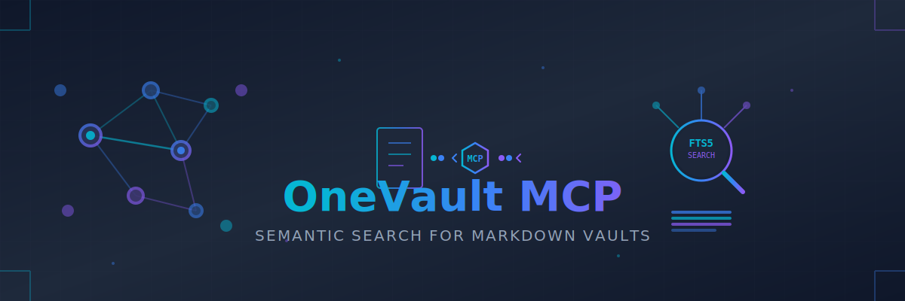

# OneVault MCP Server



MCP server providing semantic search over your Obsidian vault via SQLite FTS5 and wiki-link graph traversal.

## Installation

```bash
git clone https://github.com/cizer/onevault-mcp.git
cd onevault-mcp
npm install
cp .env.example .env
# Edit .env with your vault path
npm run build-index
```

## Features

- Full-text search with FTS5 ranking
- Wiki-link graph traversal (1-2 hops)
- Topic context assembly (search + links + tags)
- Incremental filesystem watching
- Tested manually via stdio

## Configuration

### Claude Code CLI

Add to `~/.claude/mcp.json`:

```json
{
  "mcpServers": {
    "onevault": {
      "command": "/path/to/onevault-mcp/src/index.js",
      "args": [],
      "env": {
        "VAULT_PATH": "/path/to/your/ObsidianVault",
        "DB_PATH": "/path/to/your/ObsidianVault/.onevault-mcp/vault.db",
        "EXCLUDE_DIRS": ".obsidian,.trash"
      }
    }
  }
}
```

**Note**: Configuration must be in `~/.claude/mcp.json`, not `~/.claude.json`.

### Claude Code Desktop App

Add to `~/Library/Application Support/Claude/claude_desktop_config.json`:

```json
{
  "mcpServers": {
    "onevault": {
      "command": "/path/to/onevault-mcp/src/index.js",
      "args": [],
      "env": {
        "VAULT_PATH": "/path/to/your/ObsidianVault",
        "DB_PATH": "/path/to/your/ObsidianVault/.onevault-mcp/vault.db",
        "EXCLUDE_DIRS": ".obsidian,.trash"
      }
    }
  }
}
```

Then restart Claude Code.

## Manual Testing

```bash
# Build index
npm run build-index

# Start server (stdio mode)
npm start

# Test search directly
node -e "
import { searchVault, getContextForTopic } from './src/search.js';
console.log(searchVault('cross-VS dependencies', { limit: 5 }));
console.log(getContextForTopic('AI agent orchestration risks', { limit: 8 }));
"
```

## Tools Provided

| Tool | Purpose |
|---|---|
| `search_vault` | Keyword search with ranked snippets, filterable by tag/path |
| `expand_context` | Follow links 1-2 hops from a seed note |
| `get_context_for_topic` | Assemble context bundle (search + links + tag siblings) |
| `vault_stats` | Index health check |
| `reindex_vault` | Force full rebuild |

## Technical Details

- **Index**: SQLite FTS5 with Porter stemming
- **Parser**: gray-matter for frontmatter, custom wiki-link extraction
- **Watcher**: chokidar for incremental updates
- **Protocol**: MCP SDK 1.29.0 over stdio transport

## Repo Structure

```
onevault-mcp/                   ← git repo (version controlled)
├── src/
│   ├── index.js               ← MCP server entry point
│   ├── config.js              ← Environment configuration
│   ├── db.js                  ← SQLite schema and connection
│   ├── indexer.js             ← Full & incremental indexing
│   ├── parser.js              ← Markdown + frontmatter parser
│   ├── search.js              ← FTS5 + link graph queries
│   └── watcher.js             ← Filesystem watcher
├── package.json
├── .env.example               ← Template for environment variables
├── .env                       ← Your vault path config (gitignored)
└── vault.db                   ← SQLite index (gitignored)
```

Your vault is **not under version control** — only the indexing tooling is tracked.
